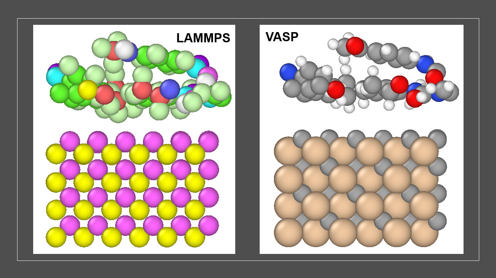

# Modeling nonbonded interactions between silicon carbide and polyurea

This repository contains molecular dynamics (LAMMPS) and density functional theory (VASP) models (shown below), which were used to compute the force-field parameters to model the nonbonded interactions between silicon carbide and polyurea in our recent article published in Extreme Mechanics Letters. More information is given in the article “[Molecular dynamics study of the penetration resistance of multilayer polymer/ceramic nanocomposites under supersonic projectile impacts]( https://www.sciencedirect.com/science/article/pii/S2352431621000407). A video abstract of the article is available here.

  
